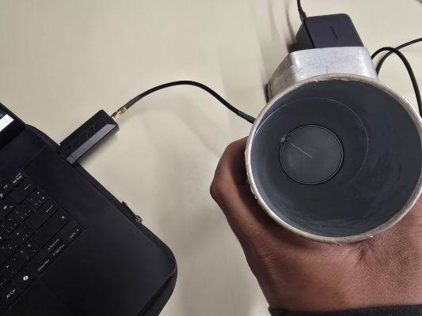

## Table of contents 


* [Project Overview](#Project-Overview) 
* [Key Features & Project Design](#Key-Features--Project-Design)
* [Repository Structure](#Repository-Structure)
* [Hardware Schematic & Pinout Mapping](#Hardware-Schematic--Pinout-Mapping) 
* [RF Waveguide Design & Physics](#RF-Waveguide-Design--Physics)
* [Digital Signal Processign (DSP) and Mathematical Engine](#Digital-Signal-Processing--Mathematical-Engine)
* [Development Structure & Phases](#Development-Structure--Phases)
* [Project Design Evolution & Future Plans](#Project-Design-Evolution--Future-Plans)

<center> 

## Project Overview


</center>

A wireless computing telemetry system with a diagnostic HUD designed on an ESP32 microcontroller. This project captures the electrochemical fluctuations of various battery cell profiles such as Lithium Ion cells, alkaline cells (double a, triple a, 9V) and a supercapacitor bank via dual analog input paths. Using the information of the electrochemical fluctuations which are usually small micro-voltage changes, this project process time & frequency domain metrics directly on the system while also broadcasting high-speed telemetry UDP packets over a 2.4 GHz Cantenna link (or hollow cylindrical cavity antenna) to a live python diagnostic dashboard. This python dashboard uses the telemetry data to record the values of each battery profile session while also processing other statistical metrics relevant to determining a battery's health as well as looking for early warning signs of a degraded battery. 

The goal of this project was to be able to find the SOC and SOH (when applicable) of various battery profiles using a variety of different processed metrics that the built system provides, while also aiming for ease of use with a wireless feature. 

* **Primary Purpose:** Real-time non-invasive battery health monitoring, impedance sag detection, and RF telemetry streaming
* **Target Chemistries:** Li-Ion Pouch / Prismatic, AA/AAA Alkaline, 9V Heavy Duty (Includes both 9V Alkaline & Carbon Zinc), Supercapacitors, 1.5V Carbon Zinc (includes both AA/AAA)
* **Telemetry Throughput:** 100 Hz broadcast rate over UDP socket

<center> 

## Key Features & Project Design

</center> 

**Triple-Display OLED HUD:** The intention was to show multiple streams of processed data at the system without needing a dedicated laptop setup each time. 
**Screen 1:** Profile Selector & A live 16-band Spectral Power Spectrum Display. This displays the background noise affecting the system and the AC ripple from the electrochemical transients of each battery profile.
**Screen 2:** Real time voltage display and SOC dynamic fuel gauge. 
**Screen 3:** 4 point DSP diagnostic matrix showing the RMS, Kurtosis, Centroid and Spectral Flatness of the current battery in real time.

<center> 

## Repository Structure

</center> 

```text
├── lab_data/
│   └── metadata.csv                    # NASA Lab metadata found online, intended for Lithium Ion rechargable battery profile - not required.
├── Smart-Battery-Firmware/
│   └── src/
│       └── esp32_firmware.cpp          # Dual I2C, oversampling, and UDP telemetry broadcasting. Also all the at the system calculations.
├── bp_data_harvester.py                # Data logging pipeline to build battery profiles for machine learning
├── Main_Dashboard.py                   # Real time HUD showing all calculated values and data for selected battery
├── nasa_battery_processed.csv          # Processed NASA lab metadata, intended for Lithium Ion Rechargable battery profile. 
├── bp_log.csv                          # Harvested data log from bp_data_harvestor.py. This data would be used for machine learning
├── dashboard_log.csv                   # Main_dashboard.py log capturing all the events of each session that is run.
└── README.md                           # System architecture & hardware documentation & Physics Explanations of the project.

```


<center> 

## Hardware Schematic & Pinout Mapping


</center>

| Subsystem / Peripheral | ESP32 GPIO | Operating Mode | Hardware Scaling / Multiplier |
| :--- | :--- | :--- | :--- |
| **Low-Voltage Channel** | GPIO 34 | Analog In (ADC1_CH6) | 10kΩ / 10kΩ Divider ($2.0\times$ multiplier, 0–4.2V max) |
| **High-Voltage Channel** | GPIO 35 | Analog In (ADC1_CH7) | 22kΩ / 10kΩ Divider ($3.2\times$ multiplier, 0–10.5V max) |
| **I2C Bus 0 (SDA / SCL)** | GPIO 21 / 22 | Hardware Wire (`0x3C`, `0x3D`) | 400 kHz for Screens 1 & 2 |
| **I2C Bus 1 (SDA / SCL)** | GPIO 33 / 32 | Hardware Wire1 (`0x3C`) | 400 kHz for Screen 3 |
| **Navigation Button** | GPIO 25 | Digital In | Button trigger |
| **Profile LOCK** | GPIO 27 | Digital In | Button trigger |


<center>  

## RF Waveguide Design & Physics

           

</center>


The system is a directional wireless telemetry system and relies on a 'Cantenna' or formally known as a cylindrical cavity waveguide. It operates at the 2.45 GHz ISM band

### 1. Wavelength calculations and parameters
* Free-space wavelength ($\lambda_0$):
  $$\lambda_0 = \frac{c}{f} = \frac{3 \times 10^8\text{ m/s}}{2.45 \times 10^9\text{ Hz}} \approx 12.24\text{ cm}$$
* $\lambda_c$ for inner diameter $D = \text{74.0} \text{ mm}$:
  $$\lambda_c = 1.706 \times D$$
  $\lambda_c$ = 12.6244 cm

* Guide Wavelength ($\lambda_g$):
  $$\lambda_g = \frac{\lambda_0}{\sqrt{1 - \left(\frac{\lambda_0}{\lambda_c}\right)^2}}$$
  $\lambda_g$ = 49.98 cm 

### 2. Probe location and dimensions
* Probe location 
    $\lambda_g$/4 = 12.5 cm from the backwall of the can
* Probe Dimensions 
    Length ($L$):**
  $$L = \frac{\lambda_0}{4} \approx 3.06\text{ cm}$$

### 3. Physics Explanation
The reasoning for constructing a cantenna in the first place is to increase directional gain of the radio waves being delivered by the ESP32 to the laptop/dashboard. In order to do this, its important to first calculate the wavelength of the ESP32 in free space, which is why we calculate the speed of light divided by 2.45 GHz where 2.45 GHz is the ISM waveband that the ESP32 broadcasts its signal (this is in the Wifi channel ISM wavebands). 

In a confined space, the wavelength is gets 'stretched' or becomes longer, which is why we calculate the guide wave length based on the inner diameter of the can and its respective cut-off wavelength. 
* Calculating the cut-off wavelength can happen through multiple formulas depending on the case, but since we have a dominantly TE11 (Transverse Electric) mode circular waveguide, we use the formula where 1.706 is the standard waveguide. The math behind the 1.706 constant comes from maxwells equations and dealing with boundary conditions where our specific TE mode was chosen because the electric field inside the can is perpendicular to the direction of propagation down the tube. 

Using the cutoff wavelength and the free space wavelength, the point of calculating the guide wavelength is to ensure that we place the probe in the correct position inside the can with respect to the backwall of the can. This correct position is to ensure that the waves bouncing back inside the can create constructive interference with the oncoming waves which is what creates the gain in the first place. 
* By calculating the guided wavelength we can place the probe a quarter of the way from the back wall of the can. To create constructive interference, the reflected wave has to hit the probe in-phase with the oncoming waves which means we need a 360 degree phase shift of the reflected wave in order to achieve this. As the wave goes to can from the probe, it shifts by 90 degrees and as it travels from the can to the probe again, it shifts another 90 degrees. As the wave also reflects off the backwall of the can, because of conductive metal boundary conditions, the wave shifts 180 degrees. So 90 degrees to the back of the can, 180 degrees after it reflects, 90 degrees back to the probe creates the 360 degree phase shift needed to be in phase with the oncoming waves. This now creates constructive interference we need and increases the strength of the signal from the ESP32. 
* the cutoff wavelength occurs because we have a circular tube that acts as a physical high pass filter for oncoming waves. Waves of a length thats longer than the cutoff wavelength cannot physically propogate through the tube and simply get reflected away. This means that having the cutoff wavelength in mind to allow for a standard 2.45 GHz signal to pass through is important, because we also need to physically allow the signal into the tube.

Lastly the probe itself has to be a proper length to ensure that the data going into the coaxial cable is clean and unaffected by high impedence. The way this works is that at the tip of the probe, the current is zero (open circuit) and the voltage is at its maximum. Using ohms law, this means that the impedence is infinite because you are dividing by 0. The goal of probe is to match the impedence of the coaxial cable of 50 ohms as data reaches the cable.
* To do this, some concepts from the Transmission Line Theory have to be applied. This is a big topic and explains how tranmission lines work, but one of the ideas we use from it is the fact that traveling a quarter length of the free space wavelength creates a 90 degree phase shift. Why this is important is we need to get from maximal voltage level and zero current, to minimal voltage level and high current. Having a low voltage creates as little impedence as possible which allows us to match the impedences of the coaxial cable easily. So using 12.24 cm as our free space wavelength to calculate a probe length of 3.06 cm, we essentially have the wave traveling a quarter phase from the tip of the probe, to the base of the probe. The base of the probe where the coaxial cable gets its data, receives a wave information that is shifted by a half $\pi$ phase where you go from maximal voltage and zero current, to zero voltage and high current which creates near-zero impedence where only the radiation resistance is left. The 50 ohm impedence to match the coaxial cable comes from the radiation impedence that occurs from the electromagnetic energy that surrounds the wire as the current pases through it. This is known as finite radiation resistance and its impedence or resistance value is close to the 50 ohm coaxial cable impedence we need at the base of the probe. 


 

<center> 


## Digital Signal Processign (DSP) and Mathematical Engine

</center> 


### Data Aquisition Pipeline
```text
Raw Analog Potential V(t)
       │ (ESP32 ADC1 @ 100 Hz / 64x Oversampling)
       ▼
Discrete Voltage Array V[n]
       │
       ▼
Hardware Resistor Divider Scaling (2.0x / 3.2x Multipliers)
       │
       ▼
Sliding Window Ring Buffer (collections.deque, N = 200–300)
       │
       ▼
1D Median Filter (SciPy medfilt, kernel_size=5) ──► Strips ADC Transients & Switching Glitches
       │
       ▼
AC Decoupling: ac_signal[n] = V[n] - μ_V ────────► Eliminates 0 Hz DC Bias for Spectral Zoom
       │
       ▼
Real Fast Fourier Transform (SciPy rfft) ────────► Positive Half-Spectrum Analysis (0 to 50 Hz)
```

### Voltage Calculation
```text 
Raw Analog Potential V(t)
       │ (ESP32 ADC1 @ 100 Hz / 64x Oversampling)
       ▼
Discrete Voltage Array V[n]
       │
       ▼
Hardware Resistor Divider Scaling (2.0x / 3.2x Multipliers)
```
 For this part of the pipeline, the goal was to properly read the voltage of the battery going into the ESP32 and output the correct reading. This was a small challenge, because the input of the ESP32 could be not larger than 3.3V or else the chip would be damaged, so to circumvent this, a voltage divider was built. 

- There were 2 voltage divider pathways built depending on whether the input battery was a low voltage battery such as a Lithium ion battery or a AA alkaline battery vs a high voltage voltage divider pathway for high voltage batteries like a series of supercapacitors or a 9V zinc-carbon battery. 

The voltage reading works by using the ESP32 internal Analog to digital convertor which is a 12 bit resolution ADC. What this means is that there are 2^12 or 4096 discrete counts or voltage levels that can be given to give an output of voltage information. So when the ESP32 recieves information at its GPIO ADC pin, it multiplies it by 3.3V (voltage ceiling of ESP32) then divides by the resolution of 12 bits which is 2^12 or 4095 (0-4095 is 4096 discrete levels). Lastly the voltage divider ensures that the voltage going is not too high for the chip where the code simply takes care of the math again to output the correct voltage.

- The reason for 2 lanes where 1 lane would've been enough is to allow for more accurate data. Although the 22k/10k high voltage divider path can work for everything, the lower voltage batteries would have outputted information that was not discrete enough for accuracy. Using the low voltage pathway allows for more discrete counts of information per volt which is a more accurate reading of the battery voltage isnce its higher resolution information.

####  <center> Formulas </center>

<center> Voltage divider to give half the input voltage </center>

$$\frac{V_{\text{pin}}}{V_{\text{battery}}} = \frac{R_2}{R_1 + R_2} = \frac{10\text{k}\Omega}{10\text{k}\Omega + 10\text{k}\Omega} = \frac{1}{2} = 0.5$$

<center> Firmware reconstruction for a proper reading </center>

$$V_{\text{Lane1}} = \left(\frac{\text{ADC}_1 \cdot 3.3\text{V}}{4095}\right) \times \mathbf{2.0}$$

<center> Voltage divider to give a third of the input voltage </center>

$$\frac{V_{\text{pin}}}{V_{\text{battery}}} = \frac{R_2}{R_1 + R_2} = \frac{22\text{k}\Omega}{10\text{k}\Omega + 10\text{k}\Omega} = 0.325$$

<center> Firmware reconstruction for a proper reading </center>

$$V_{\text{Lane2}} = \left(\frac{\text{ADC}_2 \cdot 3.3\text{V}}{4095}\right) \times \mathbf{3.2}$$

### Information Processing 
```text 
Sliding Window Ring Buffer (collections.deque, N = 200–300)
       │
       ▼
1D Median Filter (SciPy medfilt, kernel_size=5) ──► Strips ADC Transients & Switching Glitches
       │
       ▼
AC Decoupling: ac_signal[n] = V[n] - μ_V ────────► Eliminates 0 Hz DC Bias for Spectral Zoom
       │
       ▼
Real Fast Fourier Transform (SciPy rfft) ────────► Positive Half-Spectrum Analysis (0 to 50 Hz)
```

Using the collections library, I built a rolling window of 2 to 3 seconds at 100 Hz which allows the collection of data depending on the time and frequency setting I input to the code. for my code I did 300 data samples at 100 Hz. 

The scipy library also helps smooth this data where every 5 samples the center sample is replaced by the median of the other 4 samples. This reduces breadboard issues that could affect the data. 

For the AC decoupling, we have to remove the 0 Hz DC baseline bias since batteries are predominantly DC sources, which was done by subtracting the mean of the rolling data to leave only the AC voltage part of the rolling data.

RFFT (Real Fast Fourier Transform) 

- I had a sampling rate of 100 Hz to establish a 50 Hz nyquist bandwidth which also captures the low frequency electrochemical ripples from 0-15 Hz and any noise affecting the system that would cause it to spike to 15-50 Hz. 

- Using RFFT allows us to look at the data in the frequency domain which we use these values for most of the statistical analysis of the battery to check whether its healthy, and its state of charge (SOC). 

### Data Aquired Explanation

| Feature Metric | Mathematical / DSP Domain | Mathematical Formulation | Physical Meaning & Diagnostic Function |
| :--- | :--- | :--- | :--- |
| **RMS Voltage ($V_{\text{rms}}$)** | Time Domain (Energy) | $$V_{\text{rms}} = \sqrt{\frac{1}{N} \sum_{i=1}^N V_i^2}$$ | Used directly for state of charge, this shows the electric potential of the battery.  |
| **Peak-to-Peak ($V_{\text{p-p}}$)** | Time Domain (Envelope) | $$V_{\text{p-p}} = \max(V) - \min(V)$$ | Peak to peak voltage is important because it directly looks at and tracks internal battery cell resistance. |
| **Kurtosis ($K$)** | Statistics (4th Central Moment) | $$K = \frac{\frac{1}{N}\sum (V_i - \mu_V)^4}{\sigma_V^4}$$ | Essentially looks at the outlier significance within the rolling data. If an outlier is significant or there are too many outliers within the rolling window, its an early identifier that micro-shorts exist in the battery. |
| **Spectral Centroid ($f_{\text{c}}$)** | Frequency Domain (FFT Center of Mass) | $$f_{\text{c}} = \frac{\sum f_k \cdot \|X(f_k)\|}{\sum \|X(f_k)\|}$$ | Represents the power-weighted center of mass of the frequency spectrum. Distinguishes slow chemical diffusion ($< 5\text{ Hz}$) from high-frequency electrostatic discharge or switching noise ($> 20\text{ Hz}$). |
| **Spectral Flatness ($SF$)** | Frequency Domain (Wiener Entropy) | $$SF = \frac{\exp\left(\frac{1}{K}\sum \ln(\|X(f_k)\| + 10^{-10})\right)}{\frac{1}{K}\sum \|X(f_k)\|}$$ | From a range of 0 to 1.0, this value identifies whether the data is clean data or is largely affected by background noise. 0 means its a pure signal and no background noise affects the data, whereas 1.0 means its random data entirely affecte by background noise. |
| **Drift Velocity ($\frac{dV}{dt}$)** | Time Domain (Calculus) | $$\frac{dV}{dt} = \frac{\Delta V}{\Delta t} \quad [\text{mV/s}]$$ | Instantaneous rate of discharge. Identifies stable flat regions compared to rapid drops into the chemical "discharge knee". |
| **DC-SNR ($\text{SNR}_{\text{dB}}$)** | Signal Quality |   $$\text{SNR}{\text{dB}} = 20\log{10}\left(\frac{\mu_V}{\sigma_V}\right)$$   | Measures DC voltage purity relative to baseline AC noise variance ($\sigma_V$). This value degrades as internal contact resistance or EMI increases. |

---

### Data Boundaries 

| Profile Label | Physical Chemistry / Source | Operating Range ($V_{\min} - V_{\max}$) | Hardware Lane & Ratio | Baseline Idle $V_{\text{p-p}}$ Sag | Baseline Kurtosis ($K$) | Target Diagnostic / SOC Boundary |
| :--- | :--- | :--- | :--- | :--- | :--- | :--- |
| **`AA_ALK`** | Alkaline ($1.5\text{V}$ AA) | $1.0\text{V} - 1.6\text{V}$ | Lane 1 ($10\text{k}/10\text{k}$, $2.0\times$) | $\approx 30\text{--}40\text{ mV}$ | $\approx 2.8 - 3.0$ | $\text{SOC} = \frac{V - 1.0}{1.6 - 1.0} \times 100\%$ |
| **`AAA_ALK`** | Alkaline ($1.5\text{V}$ AAA) | $1.0\text{V} - 1.6\text{V}$ | Lane 1 ($10\text{k}/10\text{k}$, $2.0\times$) | $\approx 60\text{--}70\text{ mV}$ | $\approx 3.0 - 3.2$ | Higher internal $R_{\text{int}}$ creates larger sag than AA |
| **`1.5V_ZINC`** | Zinc-Carbon ($1.5\text{V}$) | $1.0\text{V} - 1.6\text{V}$ | Lane 1 ($10\text{k}/10\text{k}$, $2.0\times$) | $\approx 80\text{--}90\text{ mV}$ | $\approx 4.0 - 5.0$ | Chemical reaction noise elevates kurtosis above alkaline |
| **`LI_ION`** | Lithium-Ion Pouch / Prismatic | $3.2\text{V} - 4.2\text{V}$ | Lane 1 ($10\text{k}/10\text{k}$, $2.0\times$) | Fresh: $\le 40\text{ mV}$<br>Degraded: $\ge 120\text{ mV}$ | $\approx 3.0 - 3.2$ | $\text{SOH} = 100 - \left[\frac{V_{\text{p-p}} - 0.020}{0.120 - 0.020} \times 20\right]$<br>$\text{SOC} = \frac{V - 3.2}{4.2 - 3.2} \times 100\%$ |
| **`9V_BATT`** | 9V Zinc / Alkaline Block | $7.0\text{V} - 9.6\text{V}$ | Lane 2 ($22\text{k}/10\text{k}$, $3.2\times$) | Fresh: $90\text{--}120\text{ mV}$<br>Dead: $\ge 480\text{ mV}$ | Fresh: $\approx 2.8$]<br>Dead: $\ge 5.8$ | $\text{SOC} = \frac{V - 7.0}{9.6 - 7.0} \times 100\%$ |
| **`SUPERCAP`** | 16V Supercapacitor Module | $0.0\text{V} - 9.6\text{V}$ | Lane 2 ($22\text{k}/10\text{k}$, $3.2\times$) | $\le 15\text{ mV}$ (Near zero) | $\approx 2.9 - 3.0$ | $\text{SOC} = \frac{V - 0.0}{9.6 - 0.0} \times 100\%$<br>Fast linear electrostatic discharge |

---

### Physics Explanation

#### Degradation in Li-ion batteries

Lithium Ion Batteries degrade through multiple ways.
 * SEI layer growth: known as the "Solid Electrolyte Interphase" layer, this layer occurs at the negative anode surface as battery charges. As this layer grows, the literal amount of active lithium ions in the battery is reduced which is why the battery does not have as much charge as it previously did even at a full charge. Also as this layer develops, the internal resistance of the battery increases which restricts the lithium ions from moving as they normally do. Voltage sag or peak to peak voltage looks at this aspect of a battery, checking internal resistance to ensure its healthy. 
 * Dendritic growth: When ions that are un-intercalated start accumulating on the surface of the anode and create small lithium metal spikes they are called dendrites. These dendrites start create micro shorts in the battery or high frequency voltage fluctuations which also reduces a battery's overall health. Kurtosis and Spectral shift values look at this aspect to check whether the battery is healthy.
 * Cathode structure degrading: Recharging the battery and inserting/extracting lithium ions causes the cathode to expand and contract after a period of time. The cathode begins to have micro-cracks which reduces the overall ability to be recharged since the impedence increases. This is known as Loss of Active Material (LAM).  Voltage sag or peak to peak voltage looks at this aspect of a battery, checking internal resistance to ensure its healhty.

#### Degradation in other types of batteries

For single-use batteries they are simply irreversible redox reactions that reduce the active chemical material inside the battery where internal resistance increases to show that the SOC has decreased. 

Supercapacitors are purely a physical storage of energy by electrostatic attraction. Since supercapacitors do not have a chemical reaction occuring they have a huge operational lifespan, where their downside becomes the fact that the voltage decreases overtime through an exponential voltage drop. 

<center> 

## Development Structure & Phases

</center> 

### Phase 0: Research and planning
- Budgeting out required components of project
- Researching the physics aspects of all parts of the project, including the wireless aspect and the battery electrochemical degradation aspect. 
- Finding the type of values sought after by when recording electrochemical degradation and how each value is relevant to determining whether or not a battery is healthy. 


### Phase 1: Signal Aquisition & Multi Display Architecture
- Building the dual lane pathways for aquiring the voltage (low voltage lane & high voltage lane voltage divider paths)
- Utilizing the I2C buses on the OLED screens to allow for 3 screens to be used simultaneously
- Battery profile selector and building multiple battery profiles

### Phase 2: RF Waveguide Link 
- Physically building the cantenna and ensuring the coaxial cable and Cantenna work. 
- Firmware development to allow use of the Cantenna for wireless connection.

### Phase 3: DSP Harvesting & Validation 
- Automated Data harvesting for exploration into machine learning. This was still kept to build on the project in the future.
- Benchmark comparison: This was to compare our data where possible (specifically the lithium ion profile) to the NASA data and ensure it was accurate. 

### Phase 4: Main Dashboard HUD 
- Firmware development of the dashboard and the recording of all relevant statistical values
- Testing of the dashboard and unity of the values and calculations across all 3 files that find these values: Main_Dashboard.py , bp_data_harvester.py , esp32_firmware.cpp 

### Phase 5: Testing and Debugging
- Ensuring that the values are accurate, the graphs are working and that the profiles are correctly being recorded. 


<center> 

## Project Design Evolution & Future Plans

</center> 

### Exploration of the project

Initially this was intended to be a machine learning project where it would use the recorded data being fed into it and accurately guess which battery was connected based on its training. However, due to restrictions in my time and skill (coding a machine learning project is difficult) I decided to wait until later to try this aspect again. 

Instead I backtracked into deciding the profile my self through the selector and simply recording all the relevant data that can be recorded from electrochemical degradation signatures.

### Future plans and goals

In the future once I learn more about machine learning, I hope to implement it into this system where the battery profile is not pre-determined. Id like the system to accurately decide for itself what battery is plugged in and correctly establish a SOC and SOH (if its applicable) based on the data values its recording. 

I would also like to add more battery profiles and more identifying or distinguishing values between battery profiles. When initially exploring the machine learning idea, I realized that multiple battery profiles such as AA zinc carbon and AAA zinc carbon were almost identical with their data output when healthy, or 9V alkaline vs 9V zinc carbon. Finding more ways to distinguish between each battery would be incredibly useful as it increases the confidence rate of the 'battery' guessing that would be done by the machine learning. 

I would also like to add more relevant at the system data using either a bigger screen or better values. 

Lastly, to make this more open-source for anyone to use, it would be great to develop a PCB design for this based on the current design and future design as I believe both designs are useful. 